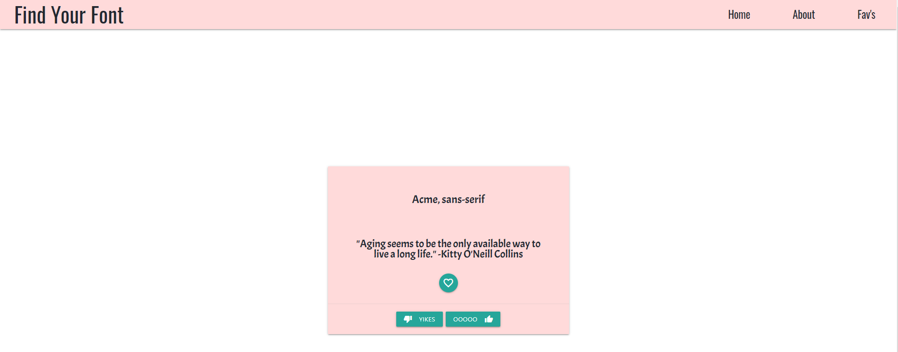

# Just Your Type

## Description

We have gamified the task of finding new fonts. Just Your Type combines the user interface of a dating application and with the excitement of new typography. Our web application uses Google Fonts API and applies the styling to a random quote generator via Quote Garden. With Just Your Type, users can see how a font is utilized with different characters, while also enjoying some wisdom of love. 

## Prerequisite

While Just Your Type mainly targets designers who utilize typography, this application is accessible to any user with an interest in typography.

## Access

Check out how Just Your Type works at
https://hanlee-311.github.io/project_1/
https://github.com/hanlee-311/project_1.git

## Our Design Process

We took inspiration from dating apps such as Tinder and Bumble. We chose to use colors that were soft and invoked feelings of love. We created a mock-up design on Figma.

Link to Wireframe via Figma
https://github.com/hanlee-311/project_1.git

Our deployed version is a much cleaner version of our mock-up. We wanted to make it clear to where all the actions happen.
