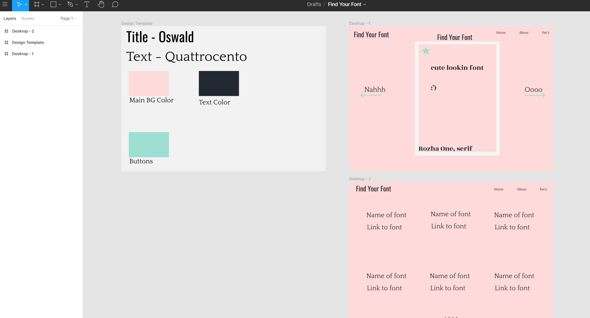
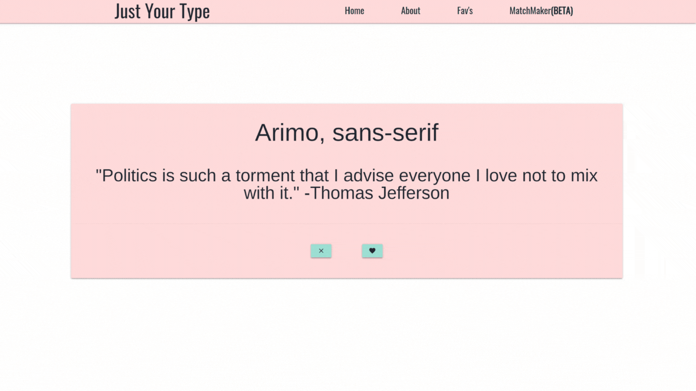

# Just Your Type

## Description

We have gamified the task of finding new fonts. Just Your Type combines the user interface of a dating application and with the excitement of new typography. Our web application uses Google Fonts API and applies the styling to a random quote generator via Quote Garden. With Just Your Type, users can see how a font is utilized with different characters, while also enjoying some wisdom of love. 

## Access

Check out how Just Your Type works at

Deployed URL: https://hanlee-311.github.io/Just-Your-Type/

Github Repo: https://github.com/hanlee-311/Just-Your-Type

## Usage

Just Your Type is easy to use. Users can follow the link under Access and utilize the application right away. Just Your Type will randomly generate a font then apply the font to a quote. You can either Favorite or Clear the font. Once a Font is Favorited, it is saved and accessible via Fav's page. On the Fav's page, users are able to view and download their favorite fonts.

## Our Design Process

We took inspiration from dating apps such as Tinder and Bumble. We chose to use colors that were soft and invoked feelings of love. We created a mock-up design on Figma.

Figma Mockup: https://www.figma.com/file/f2Q9guyviAR8LlutnEvlPL/Find-Your-Font?node-id=0%3A1

Our deployed version is a much cleaner version of our mock-up. We wanted to make it clear to where all the actions happen. Here is a GIF file of our entire project.

## Future Directions

We have some ideas for the future of Just Your Type. We want to get our MatchMaker Feature fully functional. This feature allows users to compare their favorite fonts. We also want to connect typography designers with our application and allow them to sell their fonts directly through our applciations. Lastly, we want to add a feature to filture out different types of fonts so users can select if they want Serif, Sans Serif, Handwriting, or Monotone.

## Contributors and Roles

### Barbara Kenny - Lead Javascript Developer, Debugger

Main Tasks - Figured out how to get the application working with Google Fonts API and Quote Garden. Started Development of future features.

https://github.com/BarbaraShea

### Hannah Lee - CSS and Javascript Developer, Debugger

Main Tasks - Developed the Favorite Page. Developed all the micro interactions throughout the entire project.

https://github.com/hanlee-311

### Ryan Vega - Lead CSS Developer, Designer

Main Tasks - Created initial mockup design of the project. Designed all the pages in the actual application. Made all the pages responsive.

https://github.com/vegaryanneil

